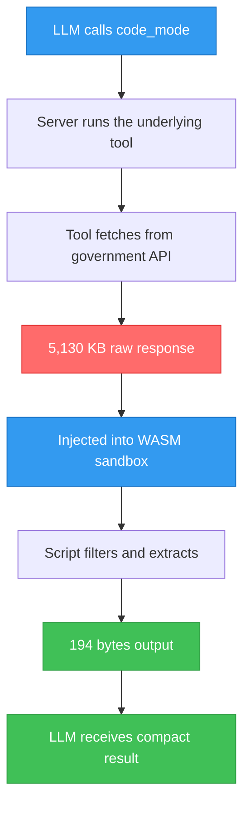
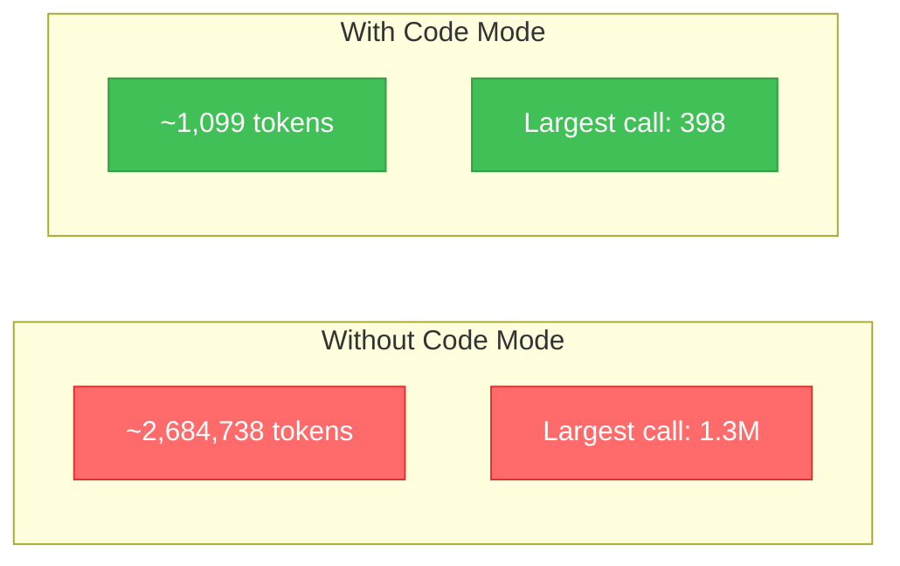
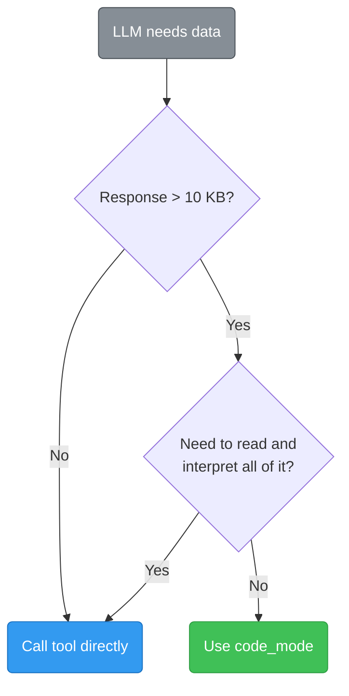

# Code Mode

When an MCP tool returns a large response — say, 50 FDA adverse event reports weighing 5 MB — that entire payload enters the LLM's context window. Code mode prevents this: the LLM writes a small processing script, the server runs it in a sandbox, and only the script's compact output (typically **under 1 KB**) reaches the LLM.

**Result: 98–100% context reduction across all tested scenarios.**

## Data Flow

The key idea: the 5,130 KB of raw data **never enters the LLM context**. The sandbox processes it and only the 194 bytes of extracted output gets returned.

The sandbox is a [QuickJS](https://bellard.org/quickjs/) engine compiled to WebAssembly — it has **no file system, no network, and no access to Node.js**. Scripts can only read `DATA` (the tool response) and write to `console.log()`. It has a 10-second timeout and 64 MB memory limit.

## Benchmarks

All numbers below are from **real API calls** to live government endpoints, measured March 9, 2026.

### Results by Scenario

| Category | What was tested | Tool Response | Code Mode Output | Reduction |
|---|---|---|---|---|
| Health | FDA drug events → top 10 reactions | 5.0 MB | 194 B | **100.0%** |
| Health | FDA drug events → deaths only | 3.5 MB | 408 B | **100.0%** |
| Health | FDA drug labels → boxed warnings | 1.0 MB | 1.6 KB | **99.9%** |
| Health | FDA 510(k) → clearance summary | 203.5 KB | 285 B | **99.9%** |
| Health | FDA NDC → DEA schedule count | 126.8 KB | 66 B | **99.9%** |
| Health | FDA shortages → status summary | 60.6 KB | 267 B | **99.6%** |
| Health | CDC mortality → national trend | 13.0 KB | 31 B | **99.8%** |
| Financial | CFPB complaints → company ranking | 185.2 KB | 301 B | **99.8%** |
| Economic | Treasury debt → latest values | 35.1 KB | 129 B | **99.6%** |
| Economic | BLS CPI → latest by category | 11.4 KB | 181 B | **98.5%** |
| Justice | DOJ press releases → title list | 81.5 KB | 941 B | **98.9%** |
| | **11 scenarios total** | **10.2 MB** | **4.3 KB** | **99.96%** |

### Token Impact

LLM tokens estimated at ~4 characters per token:

> **2,684,738 → 1,099 tokens** — a **2,442x reduction** across 11 scenarios.

### Context Window Usage

A single FDA drug events query (50 results) uses **1.3 million tokens** — more than 6x the context window of Claude 3.5 Sonnet (200K). With code mode, the same query uses **49 tokens**.

| Model | Context Window | FDA Events (Normal) | FDA Events (Code Mode) |
|---|---|---|---|
| Claude 3.5 Sonnet | 200K | 6.5x overflow ❌ | 0.025% ✅ |
| GPT-4o | 128K | 10.3x overflow ❌ | 0.038% ✅ |
| Gemini 1.5 Pro | 1M | 131% ❌ | 0.005% ✅ |

### Cost at Scale

At $3 per million input tokens (Claude 3.5 Sonnet):

| Usage | Normal | Code Mode | Saved |
|---|---|---|---|
| 1 FDA query | $3.94 | $0.0001 | **$3.94** |
| 10-tool research session | ~$7.50 | ~$0.003 | **~$7.50** |
| 100 queries/day | ~$750/day | ~$0.03/day | **~$750/day** |

## When to Use It

| Use code mode for | Call tool directly for |
|---|---|
| Counting and aggregating | Cross-referencing multiple sources |
| Filtering (e.g., deaths only) | Interpreting or explaining data |
| Extracting specific fields | Exploring unknown data ("show me everything") |
| Top-N lists | Small responses (FRED, BLS already compact) |

::: tip Rule of Thumb
**Need to _think_ about the data?** → Call the tool directly.
**Need specific _values_ from the data?** → Use code mode.
:::

## What Can Go Wrong

Code mode is powerful, but using it in the wrong situation can hurt your results.

### Worst Case: Using code mode when you shouldn't

| Scenario | What happens | Impact |
|---|---|---|
| **Cross-referencing** — "Compare FDA adverse events to lobbying spend" | Code mode extracts a count from FDA data, but the LLM never sees the individual reports — it can't connect specific drugs to specific lobbying patterns | Misses the correlations that make the analysis valuable |
| **Discovery** — "What's interesting in this drug's safety data?" | The LLM has to write extraction code _before_ knowing what's in the data — it guesses wrong and extracts the wrong fields | Returns unhelpful or misleading output |
| **Narrative context** — "Explain why this drug was recalled" | The script extracts `reason_for_recall` as a string, but the LLM never sees the surrounding context (classification, distribution, timeline) | Shallow answer missing important details |
| **Small data** — Using code mode on a 2 KB FRED response | The sandbox overhead actually makes the response _slower_ with no size benefit | Wasted processing time, same token usage |

### Best Case: Using code mode when you should

| Scenario | What happens | Impact |
|---|---|---|
| **Counting** — "How many serious vs non-serious Ozempic events?" | Script counts `serious === "1"` across 5 MB of reports, returns two numbers | 5 MB → 20 bytes. LLM has room for 5 more data sources |
| **Filtering** — "Show me only the death reports for metformin" | Script filters 100 reports down to 10 deaths, returns just those | 3.5 MB → 400 bytes. LLM sees only the relevant cases |
| **Pre-aggregation** — "What are the top 10 adverse reactions?" | Script counts reaction names and sorts by frequency | 5 MB → 200 bytes. LLM gets a clean ranked list |
| **Bulk extraction** — "List all drug names from these 510(k) clearances" | Script pulls one field from 50 records | 200 KB → 300 bytes. Clean list, no noise |

### The key difference

> **Best case:** The LLM already knows what specific values it needs, and the raw data is just a container to extract them from.
>
> **Worst case:** The LLM needs to _read_ the data to figure out what matters — extracting blindly throws away the signal.

Code mode doesn't limit analysis — it **enhances** it. By shrinking extraction calls from megabytes to bytes, it frees context space to fit more data sources in a single session. The LLM decides per-call whether to use code mode or call tools directly.
